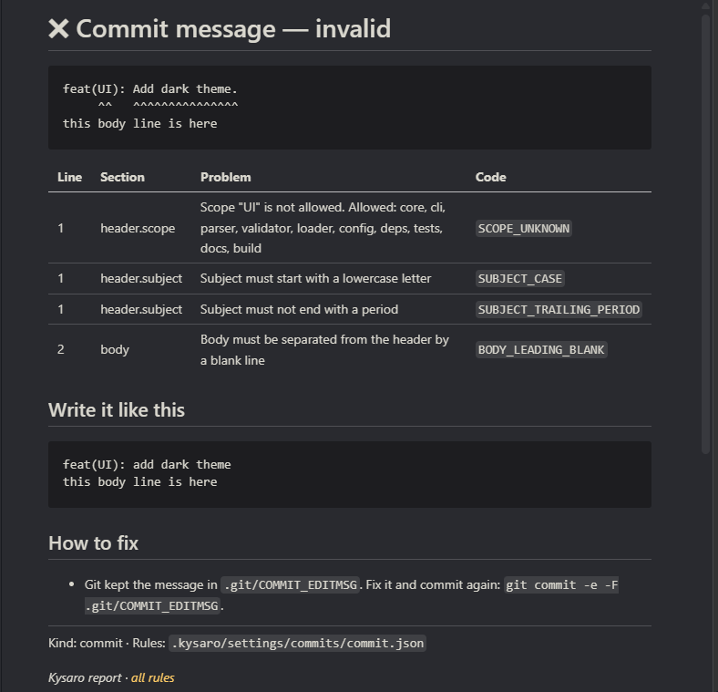

# kysaro

[](https://www.npmjs.com/package/kysaro)
[](https://github.com/murpiano/kysaro/actions/workflows/ci.yml)
[](LICENSE)

Strict commit message linter. Kysaro checks every commit message before it reaches the history and blocks the commit when the message breaks the rules.

- [Conventional Commits](https://www.conventionalcommits.org/) out of the box.
- Rules live in JSON files with JSON Schemas: your IDE autocompletes every option and highlights mistakes while you edit them.
- No commitlint, no plugins: one package, one `commit-msg` hook.
- Clear output with line numbers and a suggested header.

```text
$ git commit -m "feat(UI): Add dark theme."
[kysaro] ✖ Commit message is invalid

  feat(UI): Add dark theme.

  ✖ Scope "UI" must be in lower case  header.scope
  ✖ Subject must start with a lowercase letter  header.subject
  ✖ Subject must not end with a period  header.subject

  Suggested header: feat(ui): add dark theme
```

## Requirements

Node.js 20 or later and git.

## Quick start

```sh
npm install --save-dev kysaro
npx kysaro init
```

That is the whole setup. `kysaro init`:

1. installs the `commit-msg` hook: `.husky/commit-msg` when the project uses [husky](https://typicode.github.io/husky/), otherwise `.git/hooks/commit-msg`;
2. copies the rules into `.kysaro/settings`: one JSON file per message kind;
3. creates `.github/workflows/kysaro.yml`, which runs `npx kysaro ci` on every push and pull request;
4. adds `.kysaro/*.md` (reports) to `.gitignore`.

Commit `.kysaro/settings` and the workflow so the whole team shares the rules. Existing files are kept; `--force` overwrites them. Hooks in `.git/hooks` are not shared through the repository, so use husky when every developer needs the hook.

### What is checked

| Where | What | Rules |
|---|---|---|
| `git commit` | commit message | `commit.json` |
| `git merge`, `git pull` with a merge | merge commit message | `merge.json` |
| push to any branch (CI) | every pushed commit, merge commits included | `commit.json`, `merge.json` |
| pull request (CI) | title and description | `request.json` |
| pull request (CI) | every commit of the pull request | `commit.json`, `merge.json` |

`fixup!`, `squash!` and `amend!` commits are allowed locally for `git rebase --autosquash`, but fail in CI: squash them before merge. `git revert` messages are skipped.

Every check writes `.kysaro/report.md` with the problems, a suggested message and the commands to fix it. In GitHub Actions the report goes to the job summary.

### GitHub settings

The merge button on GitHub does not run git hooks. To make it follow the rules:

1. **Settings → General → Pull Requests:** allow merge commits and set "Default commit message" to "Pull request title and description". The merge commit then consists of the checked title and description. Do the same for squash merging if you use it.
2. **Settings → Branches:** protect `main` and require the `kysaro` status check. A pull request with an invalid title, description or commit cannot be merged.
3. Run `git config pull.rebase true`, so that `git pull` does not create merge commits.

## Message format

The default preset follows Conventional Commits with a few strict additions:

```text
type(scope)!: subject in lower case

Optional body. Separated from the header by a blank line.
Lines are at most 72 characters.

BREAKING CHANGE: description of the change
Refs: #42
```

| Part | Default rule |
|---|---|
| header | `type(scope): subject`, at most 72 characters |
| type | one of `feat`, `fix`, `refactor`, `style`, `build`, `chore`, `docs`, `test`, `perf`, `ci`, `revert`, `merge`; lower case |
| scope | optional, any value, lower case, one scope |
| `!` | optional breaking change marker before `:` |
| subject | at least 5 characters, starts with a lowercase letter, no trailing period; a first word with more capitals, like `API` or `GitHub`, keeps its spelling |
| body | optional, blank line before it, lines up to 72 characters |
| footer | optional, blank line before it, `Token: value` or `Token #value`, lines up to 72 characters |

Pull requests and merge commits use the same header rules. The differences:

| | commit | pull request | merge commit |
|---|---|---|---|
| header length | 72 | 72 | 80 |
| ` (#123)` at the end | allowed | forbidden, GitHub adds it | allowed |
| body | optional | required, at least 50 characters | required, at least 50 characters |
| body line length | 72 | not checked (Markdown) | not checked |

A pull request is checked as `<title>`, a blank line and `<description>`. The default git message `Merge branch 'feature'` is rejected: write a real message with `git commit -e` during the merge.

## CLI

```text
kysaro <file>              Check a commit message file (commit-msg hook)
kysaro -m <message>        Check a message
kysaro < message.txt       Check a message from stdin
kysaro --range <a>..<b>    Check every commit of a range
kysaro ci                  Check the pull request and pushed commits in GitHub Actions
kysaro init                Set up the hook, settings, CI workflow and .gitignore

Options:
  -m, --message <text>       Message to check
      --type <kind>          Message kind: commit, merge, request (detected by default)
      --force                init: overwrite existing hook, settings and workflow
  -h, --help                 Show help
  -v, --version              Show version
```

| Exit code | Meaning |
|---|---|
| `0` | message is valid or ignored |
| `1` | message is invalid |
| `2` | wrong arguments or broken settings |

A valid message prints nothing. Warnings are printed but do not block the commit.

## Configuration

Kysaro reads `.kysaro/settings` in the project root. A missing file falls back to the package default, so you can keep only the files you change. Resource files listed in `fromFiles` must exist next to the settings file that lists them. A broken file also falls back to the default: kysaro prints a warning and writes details to `.kysaro/main.md` or `.kysaro/commits.md`.

| File | Purpose |
|---|---|
| `.kysaro/settings/main/main.json` | pipeline stages, severity, ignored messages |
| `.kysaro/settings/commits/commit.json` | commit message rules |
| `.kysaro/settings/commits/merge.json` | merge commit rules |
| `.kysaro/settings/commits/request.json` | pull request title and description rules |
| `.kysaro/settings/resources/types.json` | allowed types |
| `.kysaro/settings/resources/scopes.json` | allowed scopes |
| `.kysaro/settings/resources/tokens.json` | allowed footer tokens |

Each file links its JSON Schema through `$schema`, so VS Code, WebStorm and other editors show descriptions, allowed values and errors inline.

### Common changes

Start the subject with an uppercase letter, the default of 0.2 and earlier, in `commit.json`, `merge.json` and `request.json`:

```json
"subject": {
  "minLength": 5,
  "case": "sentence",
  "disallowTrailingPeriod": true
}
```

Require a scope from a fixed list, `commit.json`:

```json
"scope": {
  "required": true,
  "source": { "fromFiles": ["../resources/scopes.json"] },
  "case": "lower",
  "onMultiple": "error"
}
```

Allow several scopes, `feat(ui, api): …`:

```json
"scope": {
  "required": false,
  "source": "any",
  "case": "kebab",
  "multiple": { "maxItems": 3, "separatorSpacing": "require", "unique": true },
  "onMultiple": "error"
}
```

Require a body for features and fixes:

```json
"body": {
  "required": { "when": { "type": ["feat", "fix"] } },
  "blankLineBefore": true,
  "maxLineLength": 72
}
```

Allow only known footer tokens, `commit.json`:

```json
"token": {
  "source": { "fromFiles": ["../resources/tokens.json"] },
  "case": "match-source"
}
```

Report problems as warnings instead of errors, `main.json`:

```json
"validator": { "enabled": true, "severity": "warning" }
```

Skip more messages, `main.json`. A pattern matches the start of the header, ignoring case:

```json
"ignore": {
  "kinds": ["merge", "revert"],
  "patterns": ["fixup! ", "squash! ", "amend! ", "WIP"]
}
```

### Sources

`type.value`, `scope.source` and `footer.token.source` accept:

- `"any"` — any value;
- `{ "fromFiles": ["../resources/types.json"] }` — keys of resource files, paths relative to the settings file;
- `{ "inline": ["feat", "fix"] }` — a list in place;
- both `fromFiles` and `inline` — values from both.

An empty list allows any value. Values are found ignoring case; the `case` option decides whether the spelling is correct.

### Case

| Value | type, scope, footer token | subject, footer value |
|---|---|---|
| `lower` | whole value in lower case | first letter lower case, unless the first word has more capitals (`API`, `GitHub`) |
| `upper` | whole value in upper case | whole value in upper case |
| `sentence` | first letter upper case, rest lower case | first letter upper case, rest as is, unless the first word has more capitals (`iOS`) |
| `kebab`, `camel`, `pascal`, `snake` | matches the pattern | — |
| `match-source` | spelled as in the source | — |
| `any` | not checked | not checked |

The full reference of every option, in Russian, is in [docs/SPEC.md](docs/SPEC.md).

## Rules

| Section | Issue codes |
|---|---|
| header | `HEADER_FORMAT`, `HEADER_TOO_LONG`, `HEADER_REFERENCE_REQUIRED`, `HEADER_REFERENCE_FORBIDDEN` |
| type | `TYPE_EMPTY`, `TYPE_UNKNOWN`, `TYPE_CASE` |
| scope | `SCOPE_REQUIRED`, `SCOPE_EMPTY`, `SCOPE_EMPTY_ITEM`, `SCOPE_TOO_MANY`, `SCOPE_TOO_FEW`, `SCOPE_DUPLICATE`, `SCOPE_SEPARATOR_SPACING`, `SCOPE_UNKNOWN`, `SCOPE_CASE` |
| subject | `SUBJECT_EMPTY`, `SUBJECT_TOO_SHORT`, `SUBJECT_CASE`, `SUBJECT_TRAILING_PERIOD`, `SUBJECT_WHITESPACE` |
| body | `BODY_REQUIRED`, `BODY_TOO_SHORT`, `BODY_LEADING_BLANK`, `BODY_LINE_TOO_LONG`, `BODY_WHITESPACE`, `BODY_EMPTY_LINES` |
| footer | `FOOTER_REQUIRED`, `FOOTER_LEADING_BLANK`, `FOOTER_LINE_TOO_LONG`, `FOOTER_TOO_MANY`, `FOOTER_TOO_FEW`, `FOOTER_DUPLICATE_TOKEN`, `FOOTER_TOKEN_UNKNOWN`, `FOOTER_TOKEN_CASE`, `FOOTER_VALUE_TOO_SHORT`, `FOOTER_VALUE_CASE` |
| breaking change | `BREAKING_HEADER_REQUIRED`, `BREAKING_HEADER_FORBIDDEN`, `BREAKING_FOOTER_REQUIRED`, `BREAKING_FOOTER_FORBIDDEN`, `BREAKING_FOOTER_DESCRIPTION`, `BREAKING_MISSING` |
| message | `MESSAGE_IS_EMPTY`, `CONFIGURATION_ERROR`, `COMMIT_NOT_SQUASHED` |

Before validation the message is cleaned the way git cleans it: comment lines, the `git commit -v` diff below the scissors line, extra blank lines and spaces around lines are removed. The message file itself is not changed.

## Continuous integration

`kysaro init` creates the workflow. To add the check to an existing workflow, you need a full clone and one command:

```yaml
- uses: actions/checkout@v7
  with:
    fetch-depth: 0
- run: npm ci
- run: npx kysaro ci
```

Run it on `push` and on `pull_request` with the types `opened`, `edited`, `synchronize` and `reopened`, so that editing the title or description runs the check again. Outside GitHub Actions use `kysaro --range <base>..<head>`.

## Node.js API

```js
const {lint, createLinter, COMMIT_TYPE} = require('kysaro');

const result = lint('feat(ui): add dark theme', {cwd: process.cwd()});

result.status;  // 'valid' | 'invalid' | 'ignored'
result.rules;   // 'commit' | 'merge' | 'request'
result.issues;  // [{code, message, severity, category, path, meta}]

const check = createLinter();  // loads settings once
check('feat: add x (#12)\n\nDescription…', COMMIT_TYPE.MERGE);
```

`parseMessage(message)` returns the message AST without validation. TypeScript declarations are included.

## Roadmap

Settings for these stages exist in `main.json`, but the stages are not connected yet:

- `fixer` — apply suggested fixes to the message;
- `analyzer` — typo suggestions for types and scopes, message quality checks;
- `generator` — message generation.

## Development

```sh
npm ci                 # install dependencies and git hooks
npm test               # run tests (also runs in the pre-commit hook)
npm run test:coverage  # run tests with coverage
npm start              # run the pipeline on a sample message
```

This repository checks its own commits with kysaro. Allowed types and scopes are in `.kysaro/settings/resources`.

## License

[MIT](LICENSE)
